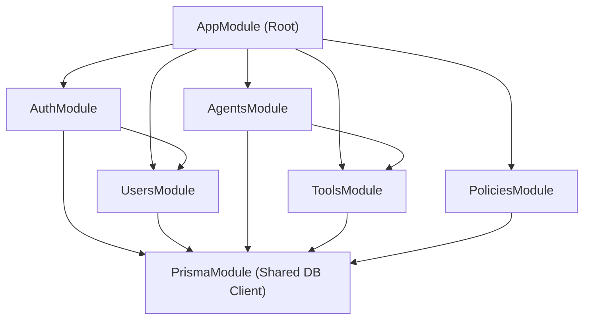
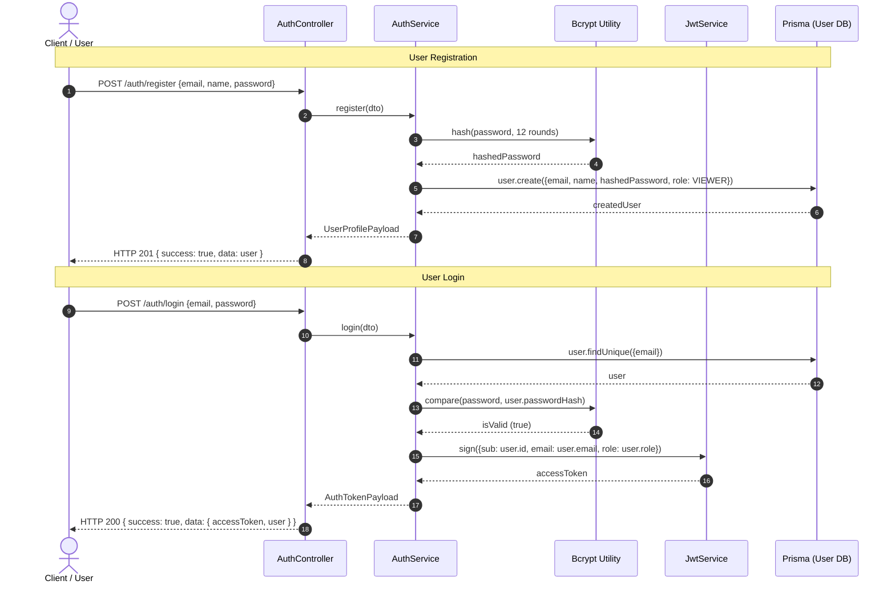
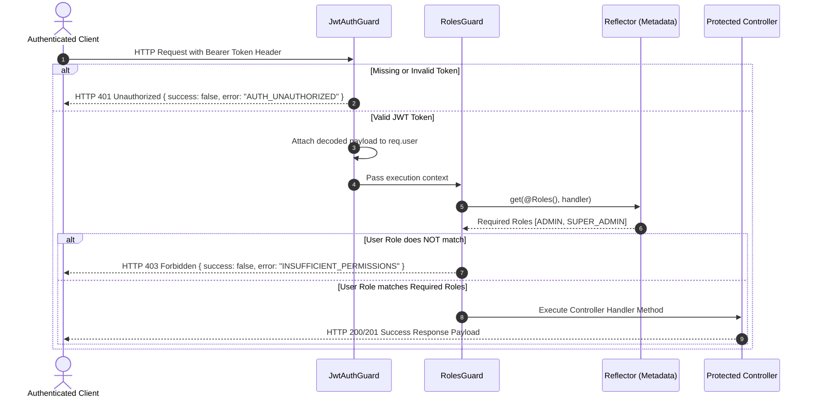
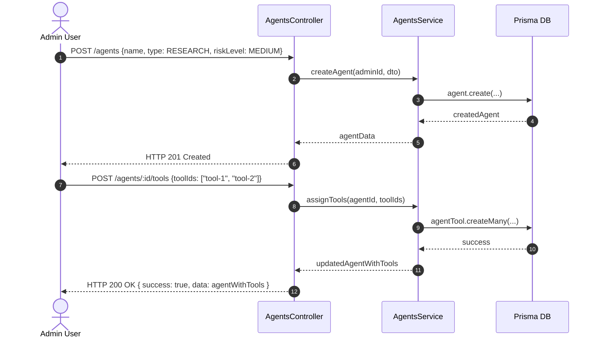

# SentinelAI — System Architecture, Module Maps & Sequence Diagrams
## Member 3 Deliverable · Semester 5 Weeks 2 & 3

---

## 1. NestJS Module Dependency Architecture

---

## 2. API Endpoint RBAC Permission Map

| Module | Endpoint | Method | Allowed Roles | Description |
|---|---|---|---|---|
| **Auth** | `/auth/register` | `POST` | Public | Register new user account |
| **Auth** | `/auth/login` | `POST` | Public | Authenticate user & issue JWT |
| **Auth** | `/auth/logout` | `POST` | All Authenticated | Invalidate session / client token |
| **Auth** | `/auth/me` | `GET` | All Authenticated | Fetch current user profile & role |
| **Users** | `/users` | `GET` | `SUPER_ADMIN` | List all users |
| **Users** | `/users/:id` | `GET` | `SUPER_ADMIN`, `ADMIN`, Self | Fetch user profile details |
| **Users** | `/users/:id` | `PATCH` | `SUPER_ADMIN`, Self | Update user profile |
| **Users** | `/users/:id/role` | `PATCH` | `SUPER_ADMIN` | Change user system role |
| **Agents** | `/agents` | `POST` | `ADMIN`, `SUPER_ADMIN` | Register new AI agent |
| **Agents** | `/agents` | `GET` | All Authenticated | List all registered agents |
| **Agents** | `/agents/:id` | `GET` | All Authenticated | View agent details & capabilities |
| **Agents** | `/agents/:id` | `PATCH` | `ADMIN`, `SUPER_ADMIN`, Owner | Update agent parameters |
| **Agents** | `/agents/:id` | `DELETE` | `ADMIN`, `SUPER_ADMIN` | Delete/deactivate agent |
| **Agents** | `/agents/:id/tools` | `POST` | `ADMIN`, `SUPER_ADMIN` | Assign allowed tools to agent |
| **Tools** | `/tools` | `POST` | `SUPER_ADMIN` | Register new tool in system |
| **Tools** | `/tools` | `GET` | All Authenticated | List all registered tools |
| **Tools** | `/tools/:id` | `PATCH` | `SUPER_ADMIN` | Update tool risk level & permissions |
| **Policies**| `/policies` | `POST` | `ADMIN`, `SUPER_ADMIN` | Create governance policy |
| **Policies**| `/policies` | `GET` | All Authenticated | List governance policies |
| **Policies**| `/policies/:id` | `GET` | All Authenticated | View specific policy details |
| **Policies**| `/policies/:id` | `PATCH` | `ADMIN`, `SUPER_ADMIN` | Update policy rules |
| **Policies**| `/policies/:id` | `DELETE` | `SUPER_ADMIN` | Delete governance policy |

---

## 3. Sequence Diagrams

### 3.1 Authentication Sequence Flow (Register $\rightarrow$ Login $\rightarrow$ JWT Issue)

---

### 3.2 RBAC Security Guard Sequence Flow

---

### 3.3 Agent & Tool Registration Workflow

