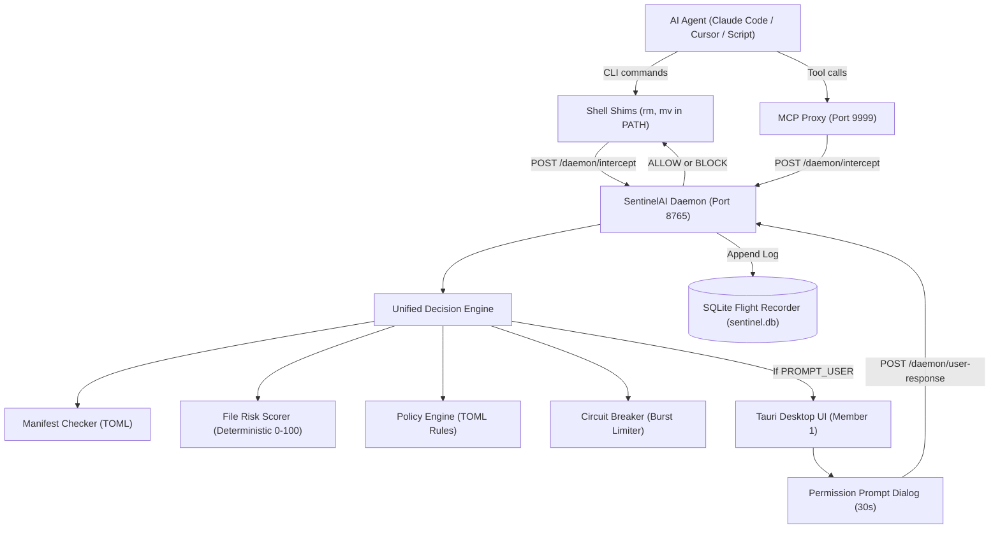
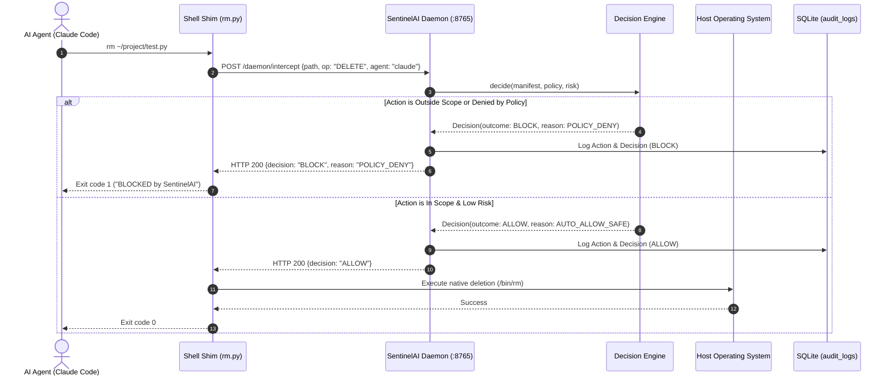
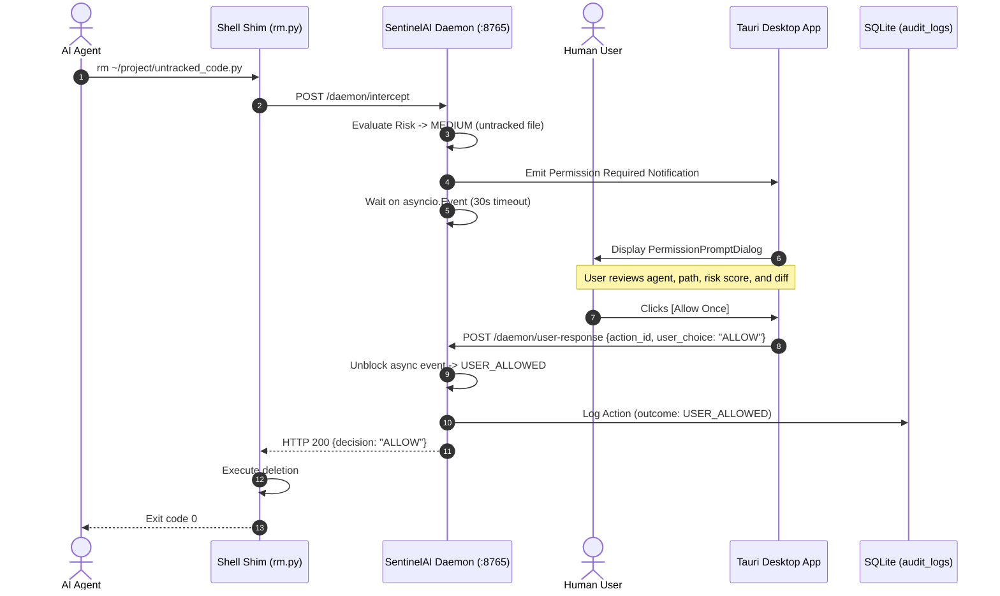

# SentinelAI — System Architecture & Sequence Diagrams
## Version 2.0 (Desktop Daemon & Interception Architecture)

---

## 1. System Module Architecture

---

## 2. Sequence Diagrams

### 2.1 Shell Shim File Deletion Interception (ALLOW / BLOCK)

---

### 2.2 Interactive Permission Prompt Flow (High-Risk Action)

